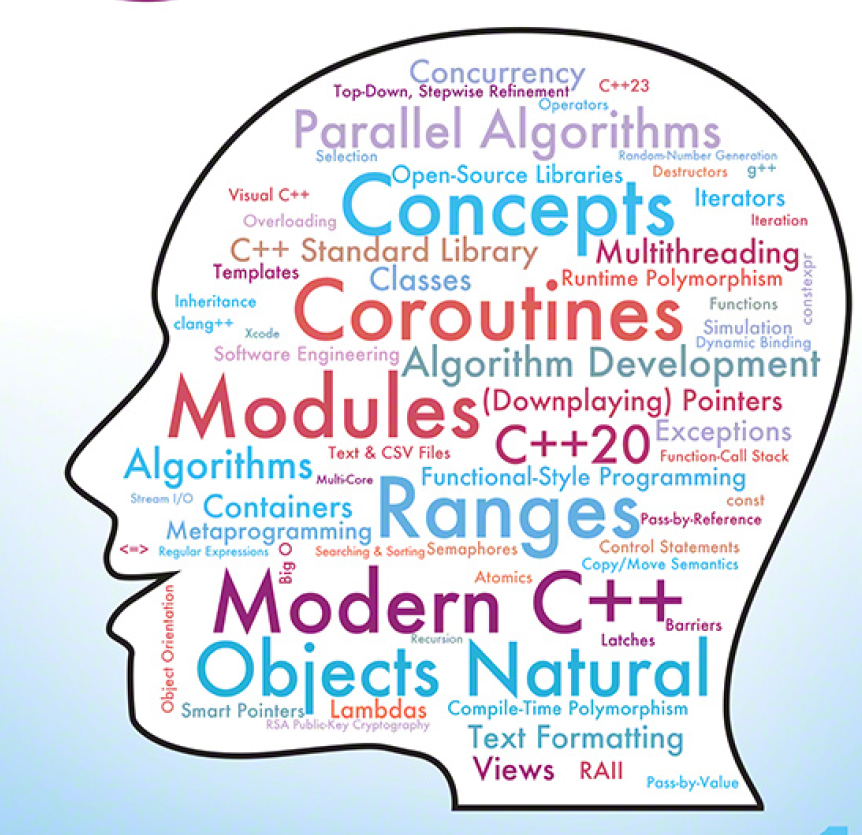

# Header

# 헤더 크기 (h1)

## 헤더 크기 (h2)

### 헤더 크기 (h3)

#### 헤더 크기 (h4)

##### 헤더 크기 (h5)

###### 헤더 크기 (h6)

# Unordered

- Item 1
- Item 2
  - Item 2a
  - Item 2b

# Ordered

1. Item 1
1. Item 2
1. Item 3
   1. Item 3a
   1. Item 3b

# 문단 구분을 위한 강제 개행

문장을 작성하면 됩니다.(공백을 안 두면..)
빈 줄이 없으면 자동으로 문장 뒤에 붙습니다.(Space Bar를 두번 이상 눌러 띄어쓰기 하면..)  
위 문장에서 두 칸의 공백을 두어 강제 개행할 수 있습니다.

# 이미지

## 첫번째 방법



## 두번째 방법

<a href="#"></a>

# 하이퍼링크(Links)

[Github](https://github.com/ljyGmail "깃허브")

# 코드 블록(Code Block)

```javascript
function test() {
  console.log("Hello World!");
}
```

# 인용 상자 (Blockquotes)

As Grace Hopper said:

> I've always been more interested.
> In the future than in the past.

# 강조(Emphasis)

_This text will be italic_

**This text also be bold**

_You **can** combine them_

# 테이블(Tables)

| First Header     | Second Header    |
| ---------------- | ---------------- |
| Content cell 1   | Content cell 2   |
| Content column 1 | Content column 2 |

# 체크박스(Task Lists)

- [x] this is a complete item
- [ ] this is an incomplete item
- [x] @mentions, #refs, [link](), --formatting--, and -del-tags</del> supported
- [x] list syntax required (any unordered or ordered list supported)

# 인라인 코드(Inline Code)

문단 중간에 `code`를 넣을 수 있습니다.  
예를 들어 `printf("hello world");` 이런 식으로 들어갑니다.

# 수평선(hr)

---

---

---

# 탈출 문자(Backslash Escapes)

\*literal asterisks\*  
_literal asterisks_  
**\*\*Text\*\***  
_Tom_

# 이모지(EMOJI)

:+1: :sparkles: :camel: :tada:
:rocket: :metal: :octocat:
