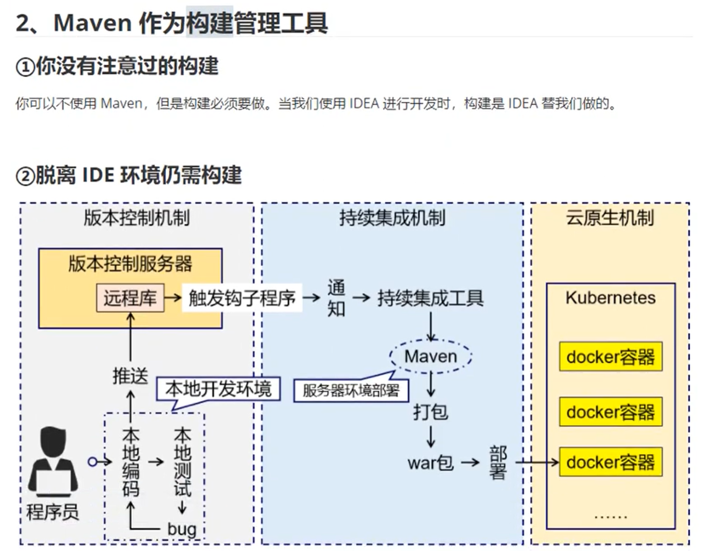

# 第一章 学习Maven的目的与简介

## 001 课程简介

## 002 Maven概述 第一节 Why Maven 依赖角度

- 只需声明几个依赖，Maven就会自动地下载需要的jar包，并维护它们之间的依赖关系。

## 003 Maven概述 第一节 Why Maven 构建角度

* 结论
1. 管理规模庞大的jar包，需要专门工具。
1. 脱离IDE环境执行构建操作，需要专门工具。

## 004 Maven概述 第二节 What is Maven 构建的概念

## 005 Maven概述 第二节 What is Maven 依赖的概念

## 006 Maven概述 第二节 What is Maven 总体工作机制
