# 第三章 使用Maven: 命令行环境

## 014 Maven 命令行 实验一 核心概念: 坐标


## 015 Maven 命令行 实验一 坐标和仓库目录的对应关系


## 016 Maven 命令行 实验一 archetype命令说明


## 017 Maven 命令行 实验一 执行命令创建工程


## 018 Maven 命令行 实验一 对创建好的工程做一点调整

* 将工程里的`pom.xml`文件改为如下内容:  


* 将生成的`App.java`和`AppTest.java`文件删除。

## 019 Maven 命令行 实验一 pom.xml解读

```
<?xml version="1.0" encoding="UTF-8"?>
<!-- 根标签: project，表示对当前工程进行配置、管理。 -->
<project xmlns="http://maven.apache.org/POM/4.0.0" xmlns:xsi="http://www.w3.org/2001/XMLSchema-instance"
  xsi:schemaLocation="http://maven.apache.org/POM/4.0.0 http://maven.apache.org/xsd/maven-4.0.0.xsd">
  <!-- modelVersion标签: 从Maven2开始就固定是4.0.0。 -->
  <!-- 代表当前pom.xml所采用的标签结构。 -->
  <modelVersion>4.0.0</modelVersion>

  <!-- 坐标信息 -->
  <!-- 在本地仓库中安装后对应的路径: -->
  <!-- com\atguigu\maven\pro01-maven-java\1.0-SNAPSHOT\pro01-maven-java-1.0-SNAPSHOT.jar -->
  <!-- groupId标签: 坐标向量之一: 代表公司或组织开发的某一个项目 -->
  <groupId>com.atguigu.maven</groupId>
  <!-- artifactId标签: 坐标向量之一: 代表项目下的某一个模块 -->
  <artifactId>pro01-maven-java</artifactId>
  <!-- version标签: 坐标向量之一: 代表当前模块的版本 -->
  <version>1.0-SNAPSHOT</version>
  
  <!-- packaging标签: 打包方式 -->
  <!-- 取值jar: 生成jar包，说明这是一个Java工程。 -->
  <!-- 取值war: 生成war包，说明这是一个Web工程。 -->
  <!-- 取值pom: 说明这个工程是用来管理其它工程的工程。 -->
  <packaging>jar</packaging>

  <name>pro01-maven-java</name>
  <url>http://maven.apache.org</url>

  <!-- properties标签: 在Maven中定义属性值 -->
  <properties>
	<!-- 在构建过程中读取源码时使用的字符集 -->
    <project.build.sourceEncoding>UTF-8</project.build.sourceEncoding>
  </properties>
  
  <!-- dependencies标签: 配置具体依赖信息，可以包含多个dependency子标签 -->
  <dependencies>
	<!-- dependency标签: 配置一个具体的依赖信息 -->
    <dependency>
	  <!-- 坐标信息: 导入哪个jar包，就配置它的坐标信息即可 -->
      <groupId>junit</groupId>
      <artifactId>junit</artifactId>
      <version>4.12</version>
	  
	  <!-- scope标签: 配置当前依赖的范围 -->
      <scope>test</scope>
    </dependency>
  </dependencies>
</project>
```

## 020 Maven 命令行 实验一 核心概念: POM


## 021 Maven 命令行 实验一 核心概念: 约定的目录结构


## 022 Maven 命令行 实验二 添加Java代码

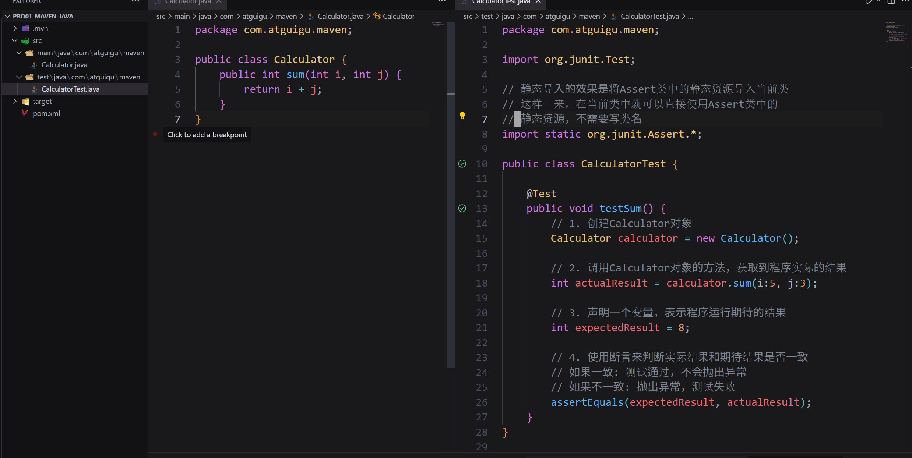

## 023 Maven 命令行 实验三 clean和compile命令

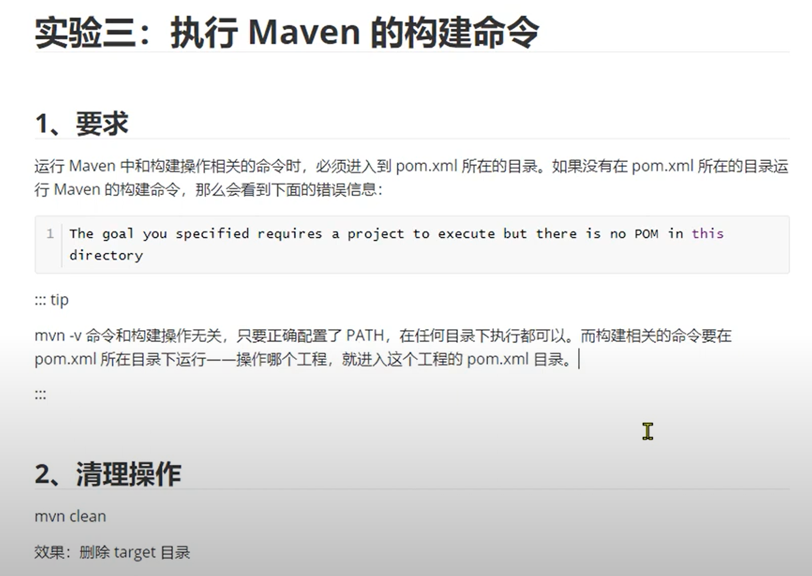
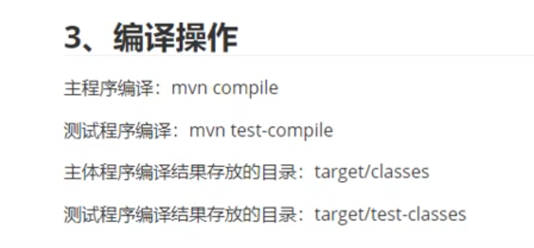

* 执行`mvn compile`和`mvn test-compilel`后:  
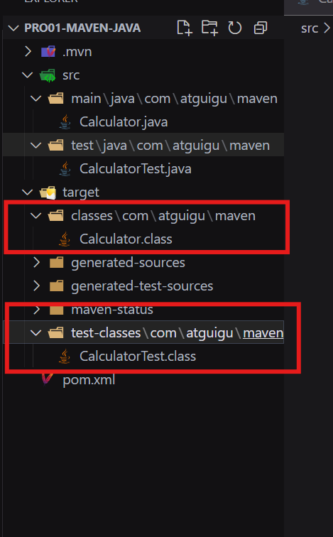

* 执行`mvn clean`后:  
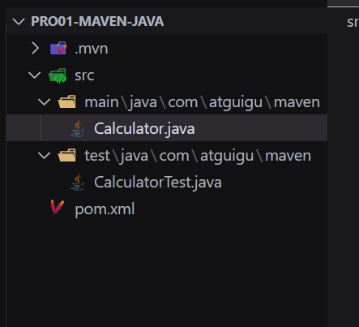

## 024 Maven 命令行 实验三 test命令

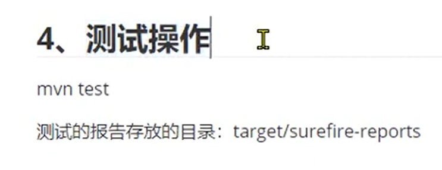

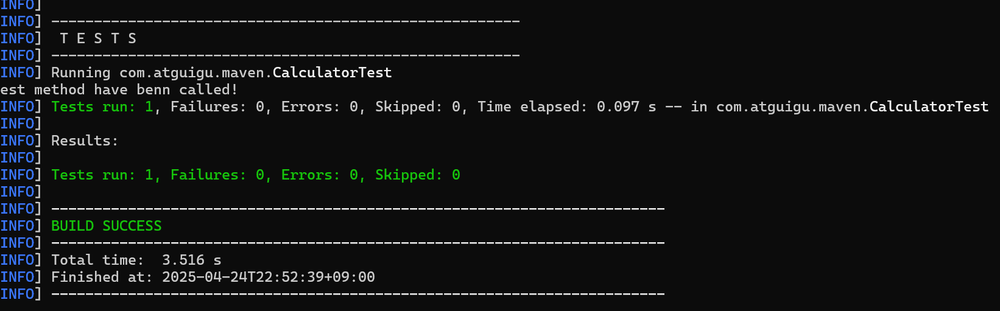

## 025 Maven 命令行 实验三 package命令

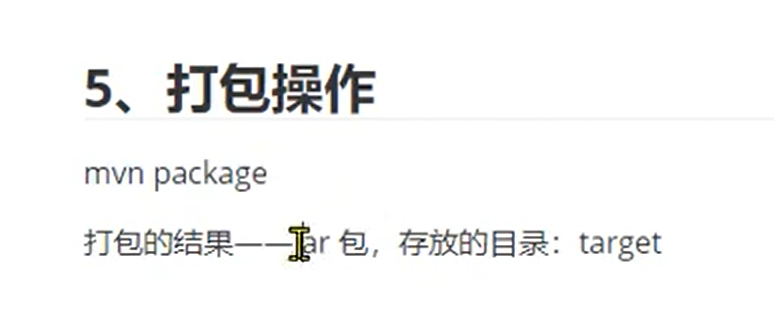

* 执行`package`命令后:  
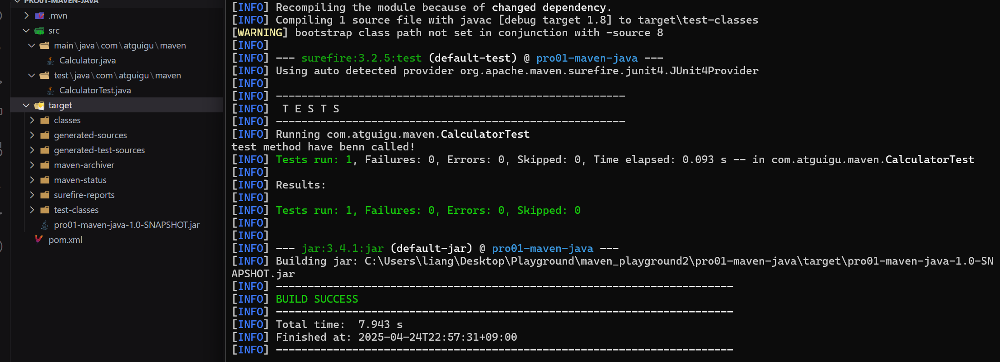

## 026 Maven 命令行 实验三 install命令

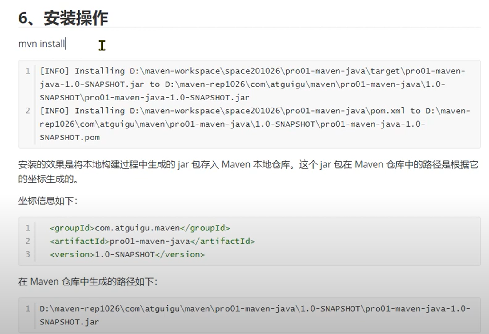  

* 执行`install`命令后:  

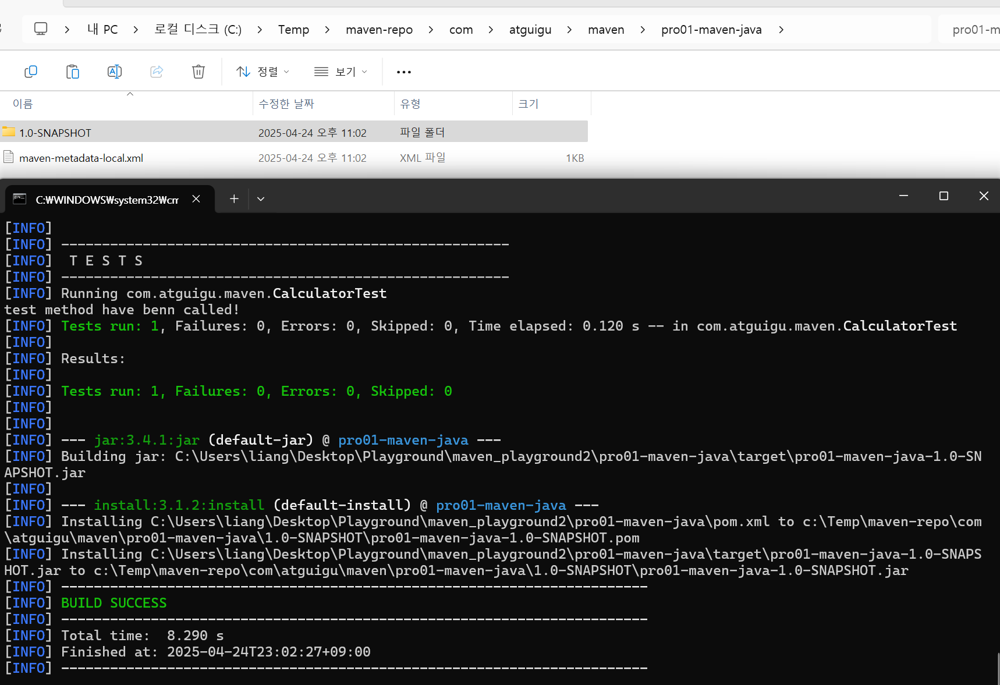

## 027 Maven 命令行 实验四 生成Web工程 执行生成

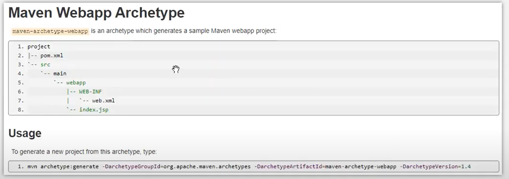  

```
mvn archetype:generate -DarchetypeGroupId=org.apache.maven.archetypes -DarchetypeArtifactId=maven-archetype-webapp -DarchetypeVersion=1.4
```

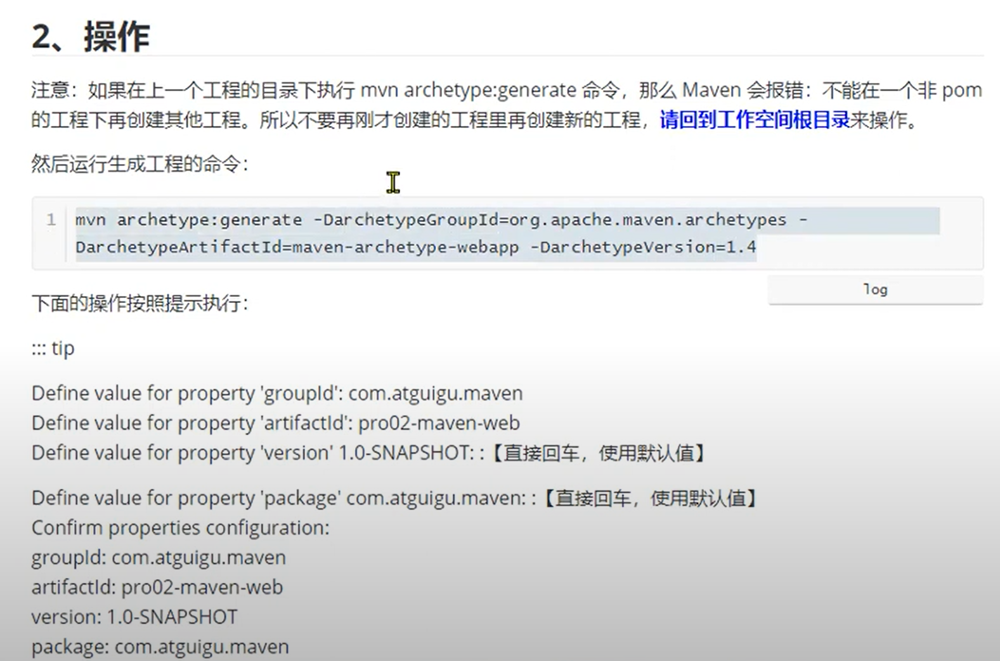  

## 028 Maven 命令行 实验四 生成Web工程 执行构建

* 添加如下Servlet, web.xml, jsp内容

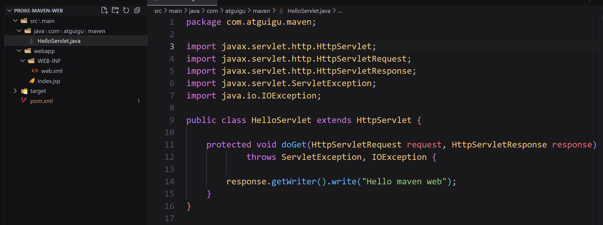  
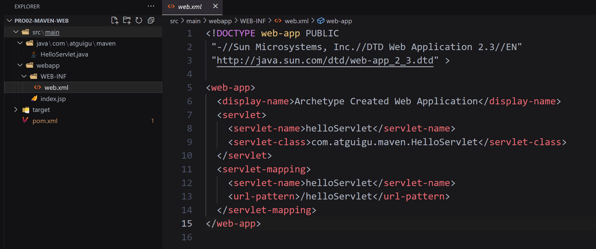  
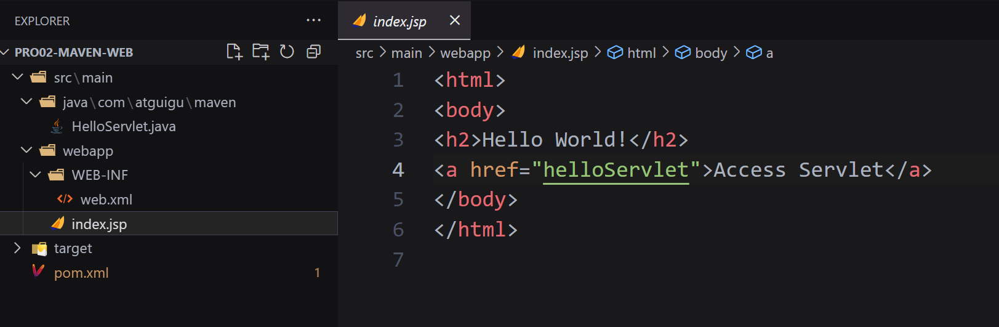  

* 此时如果用maven执行编译不会通过，因为还没有引入servlet-api的jar包。在pom.xml中添加如下配置:

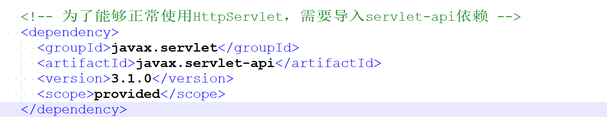  

* 使用`mvn package`命令进行打包，可看到生成的war包。

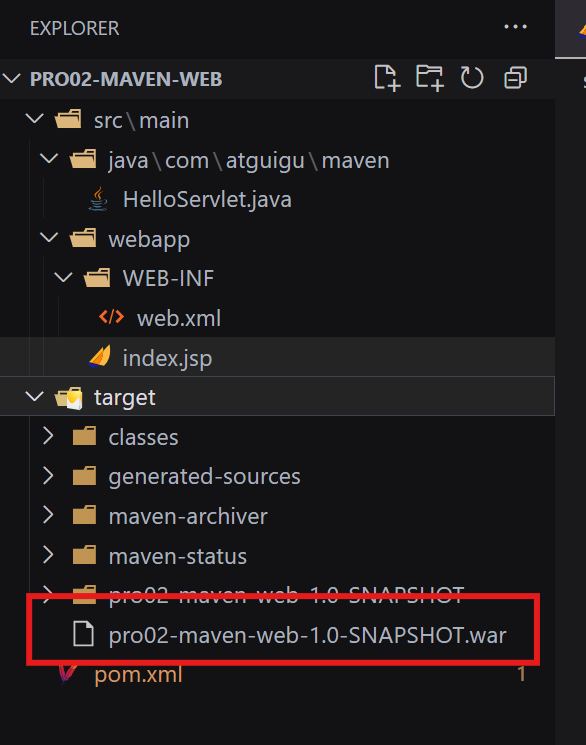  

## 029 Maven 命令行 实验四 生成Web工程 执行部署

* 将生成的war包或同名的目录复制到tomcat的webapps目录下，完成部署。

  