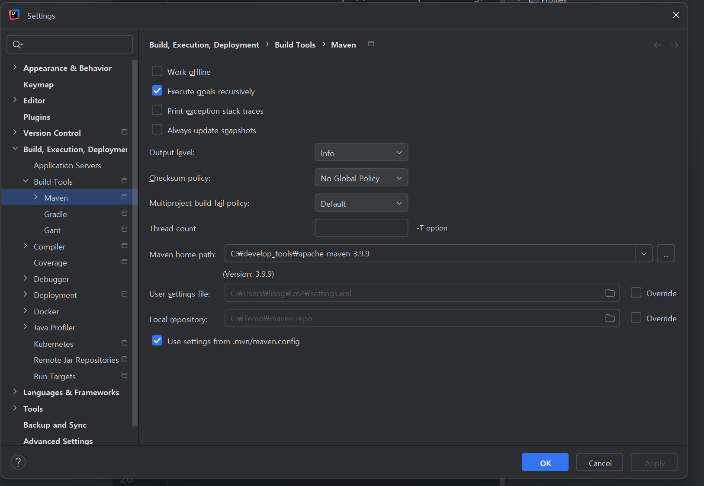
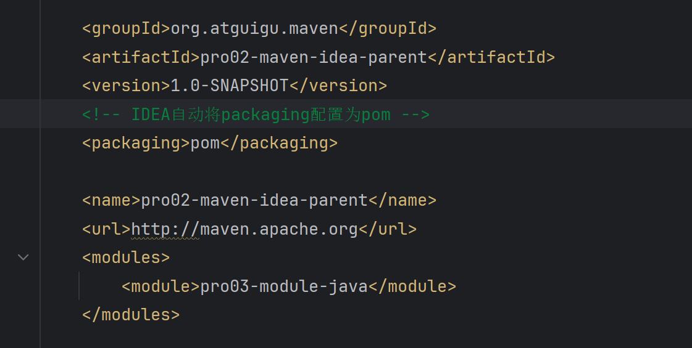
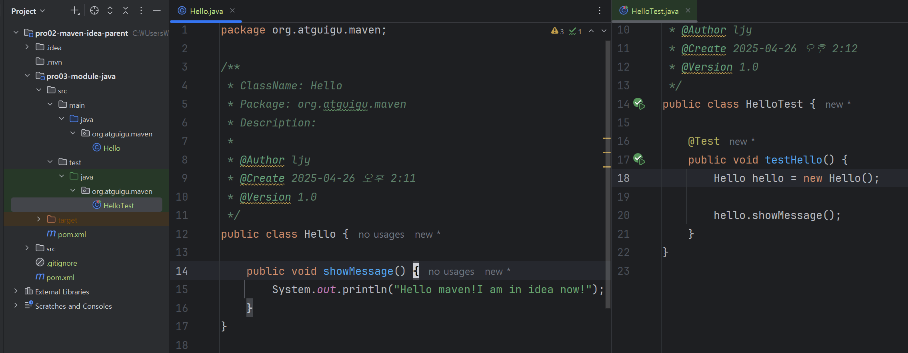
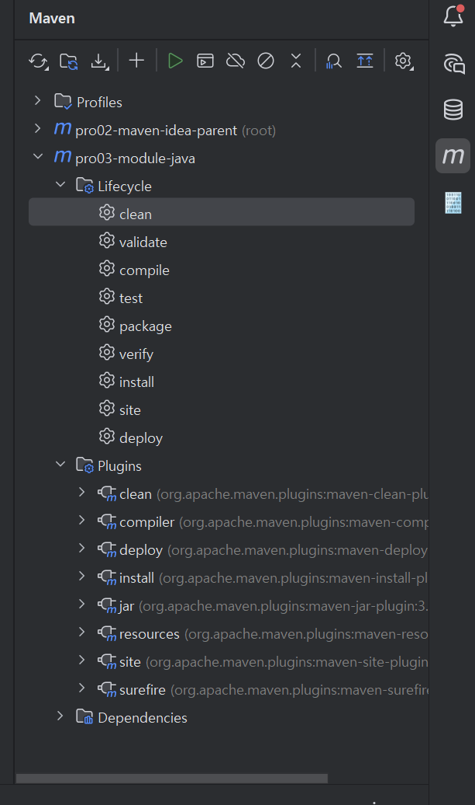
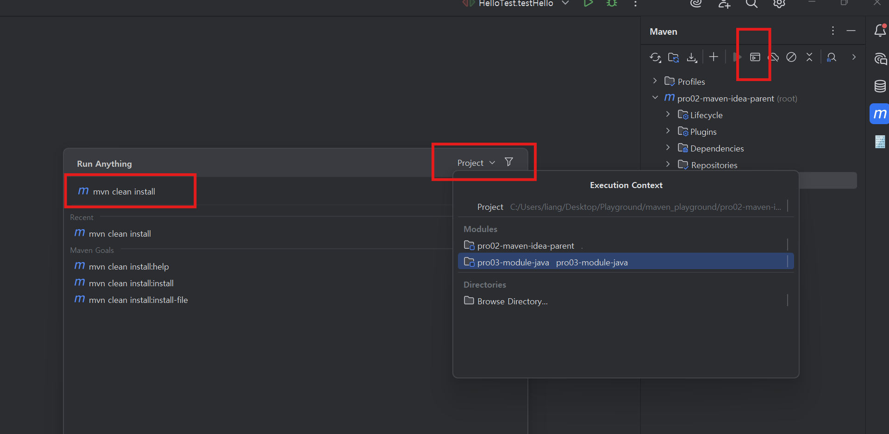
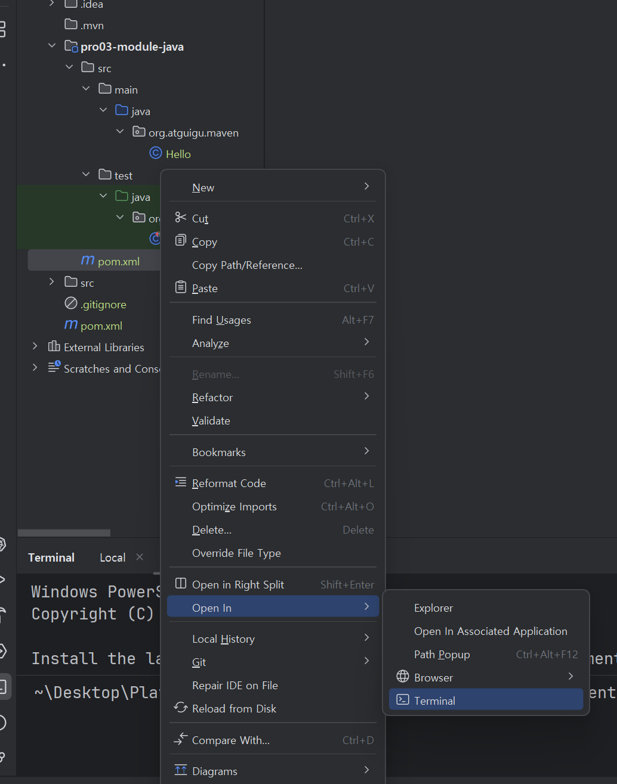
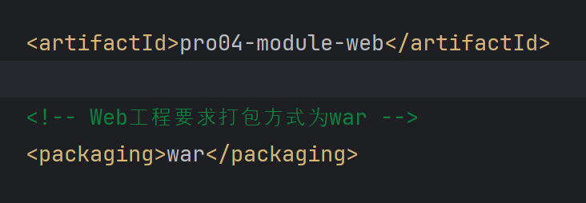
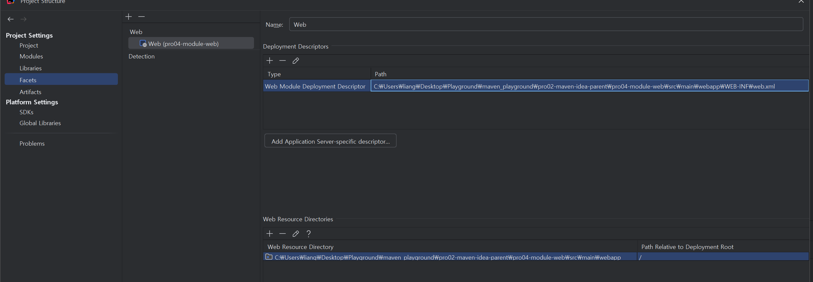
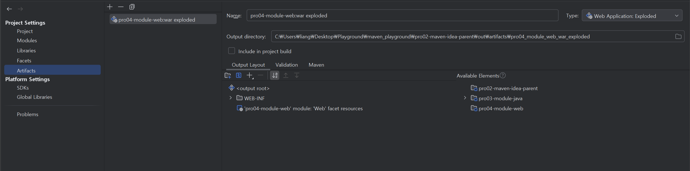
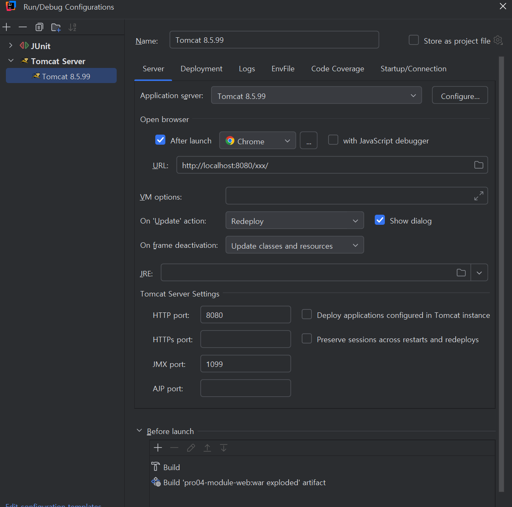

# 第四章 使用Maven: IDEA环境

## 044 Maven IDEA 创建父工程并初步配置

* 在IDEA中创建Maven工程

* 设置IDEA使用的Maven路径



## 045 Maven IDEA 创建Java Module

* 创建子模块化后，父工程的pom.xml会自动更新`packaging`和`modules`:



* 在子模块中创建测试程序:



## 046 Maven IDEA 三种方式执行Maven命令

* 第一种方式: 鼠标点击执行Maven命令



* 第二种方式: 弹窗输入Maven命令



```
如果有需要，还可以给命令后面附加参数:

# -D表示后面要附加命令的参数，字母D和后面的参数是紧挨着的，中间没有任何其它字符
# maven.test.skip=true 表示在执行命令的过程中跳过测试
mvn clean install -Dmaven.test.skip=true
```

* 第三种方式: 打开Maven命令窗口



## 047 Maven IDEA 创建Web Module






## 048 Maven IDEA 导入Project

* 使用命令行创建Maven项目后，在IDEA的File菜单中Open即可导入项目。

## 049 Maven IDEA 导入Module Java Module

* 从其它的项目中复制子模块，并在设定中添加模块。如果必要，还有修改当前项目中的`pom.xml`文件。

## 050 Maven IDEA 导入Module Web Module

* 从其它的项目中复制子模块，并在设定中添加模块。确认`Facets`和`Artifacts`的配置是否正确，并配置在Tomcat中部署。