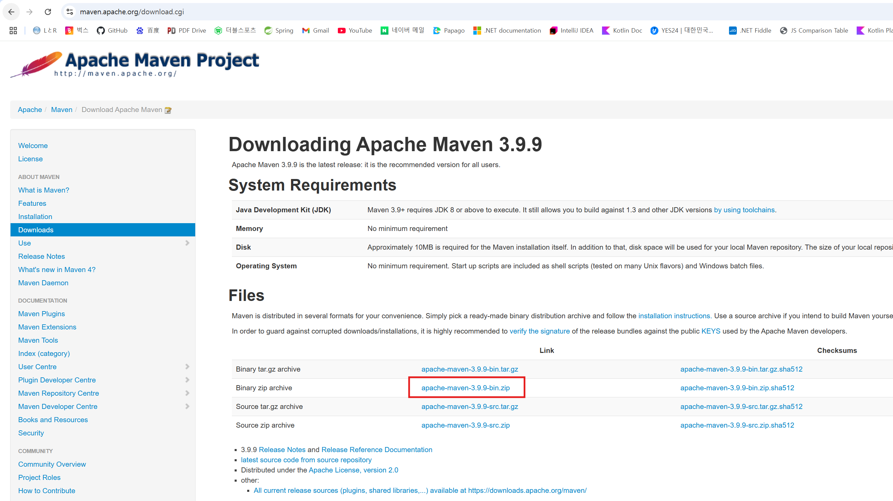
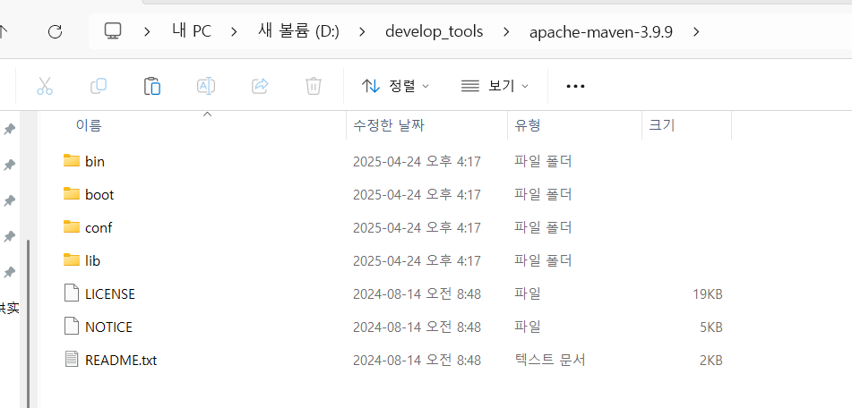
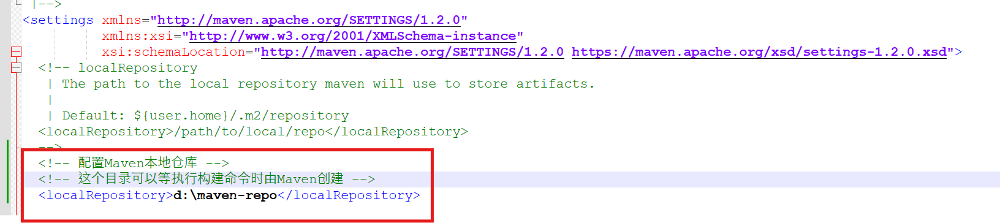
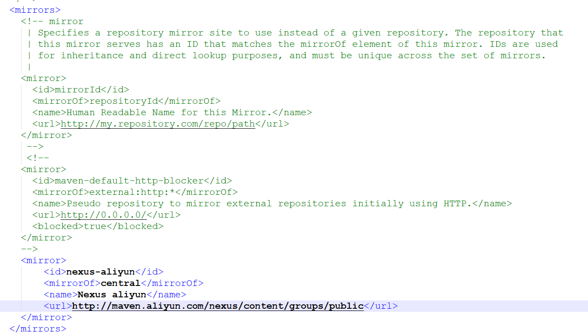
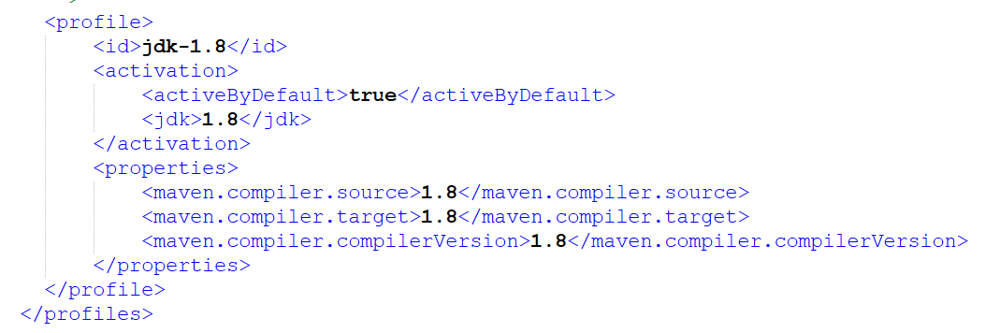
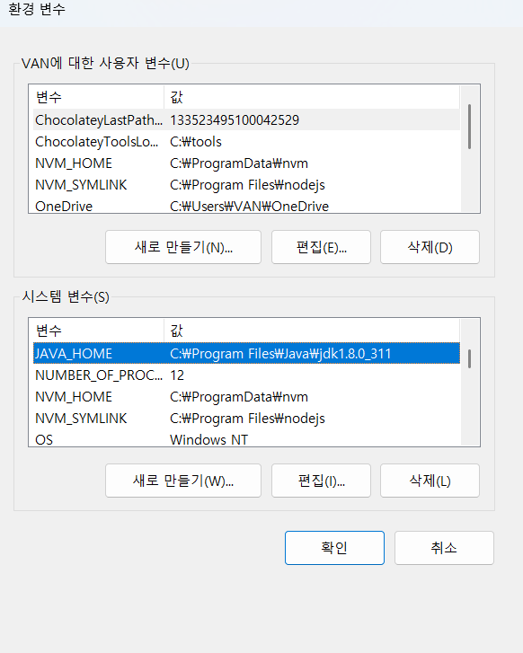
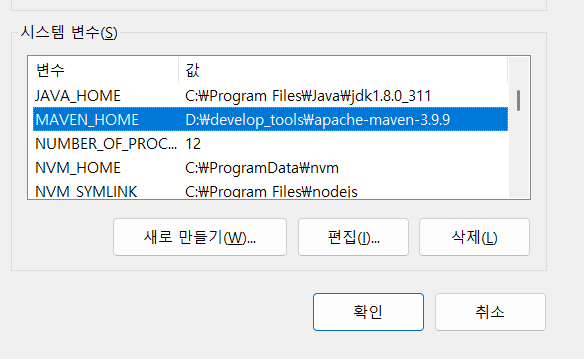
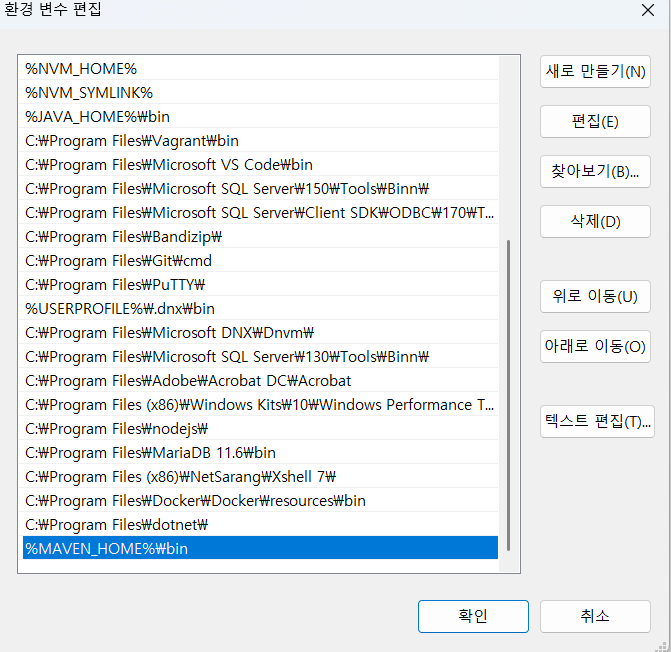
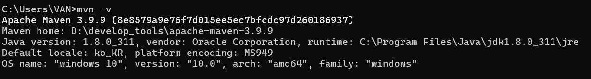

# 第二章 Maven核心程序解压和配置

## 007 Maven安装 第一节 核心程序 下载

## 008 Maven安装 第一节 核心程序 解压

## 009 Maven安装 第一节 核心程序 配置本地仓库

- 在Maven文件夹下的conf/中的`settings.xml`中添加如下配置，从而指定本地仓库。

## 010 Maven安装 第一节 核心程序 配置镜像仓库

## 011 Maven安装 第一节 核心程序 配置JDK版本

## 012 Maven安装 第二节 环境变量 确认正确安装JDK

## 013 Maven安装 第二节 环境变量 配置MAVEN_HOME和PATH

